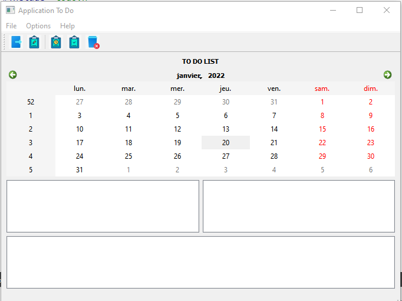
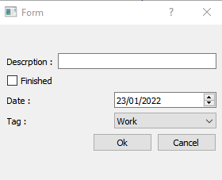
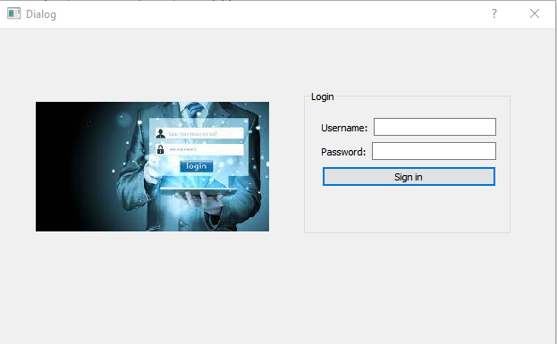
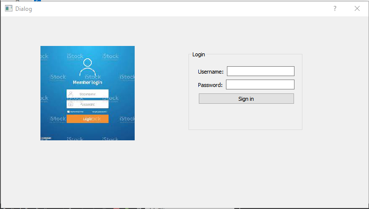

<h1 align="center"> To Do Appliacation</h1> 
 <p align="center"> <br>Welcome To our Application: TO DO  </p>
 
<h2 align="center">Objective</h2> 

The goal of the homework is to create an application to manage your tasks. It should have all the features of main application such as menues, actions and toolbar. The application must store an archive of all the pending and finished tasks.


<h2 align="center"> Use Cases</h2> 

Here is a list of cases that the user could perform with our app:
* A user should be able to close the application of course.
* A Todo application cannot be useful, unless it offers the possibility of creating new tasks.
* The essential components of a task will be defined later
* The View of the main widget should be split in three areas:

* The first (en persistent) area shows the list of today tasks.
* The second one is reserved for pending task (tasks for the future).
* Finally, the third one shows the set of finished tasks.
* Each category must be shown with a custom icon.

* The user could either hide/show the pending and finished views.
* Finally, the tasks entered to your application must remains in the app in future use.
* Meaning, If I create a task and I close the application, next time I opened the application, I should find my tasks and not start from scratch.

* You should write a report on the following concepts:
* A detailled description of an Item based solution for your widgets.
* A second part which contains an MVC Model using either:an **QAbstractTableModel or QSqlQueyrModel**.

<h2 align="center"> Introduction</h2> 

Welcome to our Application,**To Do** is a simple application help users to organize the tasks,is like a calender,you put your tasks that you want do it in the future or may be a task for today and you can also add the finished tasks.It **very usefull and simple** to use it.

<h2 align="center"> Steps to use the application</h2> 

* To access to the application you should to log in by using your login and password in order to enhance the privacy.<br>
* When you login in, first of all you should to do is to go to **file** and click add **new_Task**. <br>
* Than fill the description,choose the date,the corresponding tag and click on **ok**.<br>
* you will see that your task is added in one of the list it depends on the date you choose.<br>
* you can delete the task if you make a mistake when you are filling by clicking on **delete**.<br>
* you can quit the application and if you open the application next time,you find yours tasks and not start from scratch.<br>
* you have the choise of **show/hide** pending and finished tasks.<br>
* Finally I leave you to discover yourself the rest of fuctionalities.<br>

<h2 align="center"> Version</h2> 

 We are creating this application in two version different but have the same work:<br>

* **Version 1:** Using Items Based Widgets in this version we are using **Qlistwidget** to store the tasks added and **Qfile** to to save the content of the application.<br>
* **Version 2:** Using MVC Model,in this version we are using **QlistView** to store the tasks added ,and **QSqlTableModel** base to save the content of the application.<br>
* For More information about this Course **Developing IHM with QT C++** and specific this chapter [click on this link](https://anassbelcaid.github.io/CS311/lectures/widgets2/#mvc-model)<br>

<h1 align="center"> Version 1</h1> 
 <h3>Description</h3>
 
* In the first version we are creating the application using the **Itembased**.
* Our application contain a menu bar this later have **File,Options and Help** as **Menus**,each menu have **Actions**.
* The **menu file** have **new task, delete task and quit**,**new_task**  allow user to add a new task by filling the description ,choosing the date and the tag for this task,**delete** is to delete the task if you make an mistake and **quit**if you want to quit the appliction.
* The **menu options** have **pending and finished** this both allow user to **hide or show** widgets .
* The **menu Help** have two action **About Application** that show information avout TODO and **About_QT** that show information about QT.
* All this is showing in **the listwidget** ,if the user choose the date of today the task will be added in listwidjet 1,but if choose the future it will be added in listwidget2 else in the last listwidget.
* We are adding a **Toolbar**,is contains the **icons** of all our Action.
* We are adding a **calender** to display the date.
* If you **quit** the application and newt time when you opened the application, you **find youurs tasks** and  you will not start from scratch. 
* **For more details about our code you will find comment in all classes**.

<h4 align="center"> Good Reading </h4>


<details>
<summary>The mainwindow of the application</summary>
<br>
 <h3>Description</h3>
 <p>This part contain the implimentation.h and implimentation.cpp of the mainwindow of todo,for each declaration in the code you will find a comment explain
 its functionality.
 </p>
 
<details>
 
<summary> todo.h</summary>
 
``` 
#ifndef TODO_H
#define TODO_H

#include <QMainWindow>
#include <QTextStream>
#include <QMessageBox>
#include<QListView>
#include<QStringListModel>
#include<QListWidget>
#include <QDate>

QT_BEGIN_NAMESPACE
namespace Ui { class todo; }
QT_END_NAMESPACE

class todo : public QMainWindow
{
    Q_OBJECT

public:
    todo(QWidget *parent = nullptr);
    ~todo();

    void chargerTasks(QString myFile);//method to save the content of each listwidget


private slots:

        void on_actionAbout_Application_triggered();//slot gives information about application
    
        void on_actionAbout_QT_triggered();//slot gives information about QT 
    
        void on_actionNew_Task_triggered();
    
        void on_actionQuit_Task_triggered();//slot allow user to quit the application
    
void on_actiondepending_triggered();//slot allow user to hide/show the pending tasks
    
void on_actionFinished_task_triggered();//slot allow user to hide/show the finished tasks
    
 //void ourelmnt(QIcon icon, QString str1, QDate thedate, QString str2, QListWidget *list);
    
void on_actionDelete_Task_triggered(); //slot allow user to delete tasks 
private:
Ui::todo *ui;
void  addelement(); //method contain the implmentation of adding new task when user click on add new task    
};
#endif // TODO_H
 
```
 
 
</details>
 
 

<details>
<summary>todo.cpp</summary>
<br>

```
 
#include "todo.h"
#include "ui_todo.h"
#include"newdialog.h"
#include<QPixmap>
#include<string>
#include<fstream>
#include<QTextStream>
#include<QFile>
#include<QFileDialog>
#include<QModelIndex>
todo::todo(QWidget *parent)
    : QMainWindow(parent)
    , ui(new Ui::todo)
{
    ui->setupUi(this);

    this->setWindowTitle("Application To Do");   //title of the application 
    //allow user to drag and drop from listWidget 1 to listWidget 2&3
    ui->listWidget->setDragEnabled(true);
    ui->listWidget->setAcceptDrops(true);
    ui->listWidget->setDropIndicatorShown(true);
    ui->listWidget->setDefaultDropAction(Qt::MoveAction);
    
    //allow user to drag an dd drop from listWidget 2 to listWidget 1&3
    ui->listWidget_2->setDragEnabled(true);
    ui->listWidget_2->setAcceptDrops(true);
    ui->listWidget_2->setDropIndicatorShown(true);
    ui->listWidget_2->setDefaultDropAction(Qt::MoveAction);
    
    //allow user to drag and drop from listWidget 3 to listWidget 1&2
    ui->listWidget_3->setDragEnabled(true);
    ui->listWidget_3->setAcceptDrops(true);
    ui->listWidget_3->setDropIndicatorShown(true);
    ui->listWidget_3->setDefaultDropAction(Qt::MoveAction);
    
    //make call to the method that save the content of listwidgets
    chargerTasks("C:\\Users\\Hsaine\\Desktop\\S5\\Todo\\Todo\\file.txt");
    
    //connect the addelement to Qaction Add new task
    connect(ui->actionNew_Task, &QAction::triggered, this, &todo::addelement);


}


todo::~todo()
{
    delete ui;
}
 //impliment the new slot
void todo::on_actionNew_Task_triggered()
{


}


void todo::addelement()
{
          //create the dialog
          newdialog D;
          D.setModal(false);
          
          QString newtask;

          //exécuter le dialogue
          auto reply = D.exec();
  //create the icons
          QPixmap icon(":/new.jpeg");
          QPixmap icon1(":/finish.jpeg");
          QPixmap icon2(":/depending.jpeg");
   //Checking if the dialog is accepted
          if(reply == newdialog::Accepted)
                 {
               QString str1=D.lineEdit();  // Get the line edit text
               QString str2=D.combobox();  // Get the tag 
              if (str1!=NULL){
                  //Get Finished bool
                  QString finished = D.checkboxstatus();
                // Get current date
                QDate thedate=D.getdate();
              newtask = str1 +"\t Due:"+ thedate.toString()+"\t tag:" +str2+"\n";

                   if (finished=="finished" || thedate < QDate::currentDate())
                   {
                       newtask = "Finished\t" +str1 +"\t Due:"+ thedate.toString()+"\t tag:" +str2+"\n";
                       ui->listWidget_3->addItem(new QListWidgetItem(QIcon(icon1),newtask));
          }
                   else if (thedate==thedate.currentDate()&& str2!="other"){

                       newtask = "Today \t" +str1 +"\t Due:"+ thedate.toString()+"\t tag:" +str2+"\n";
                       ui->listWidget->addItem(new QListWidgetItem(QIcon(icon),newtask));
                   }
                   else{


                                 newtask = "Pending\t"+str1 +"\t Due:"+ thedate.toString()+"\t tag:" +str2+"\n";
                                 ui->listWidget_2->addItem(new QListWidgetItem(QIcon(icon2),newtask));

                   }
          }


       }

       QString fichier = "C:\\Users\\Hsaine\\Desktop\\S5\\Todo\\Todo\\file.txt";
       QFile file(fichier); // Appel du constructeur de la classe QFile
       if (file.open(QIODevice::Append | QIODevice::Text)) {
       // Si l'ouverture du fichier en écriture à réussie

       // écrire dans le fichier en utilisant un flux :
       QTextStream out(&file);
       out << newtask;
       // Fermer le fichier
       file.close();
       }

    }
void todo::chargerTasks(QString myFile){

    QFile fichier(myFile);

    if(fichier.open(QIODevice::ReadOnly | QIODevice::Text)) // ReadOnly on lecture // ::Text si le fichier est deja ouvert
    {
        QTextStream flux(&fichier);
        while(!flux.atEnd())
        {
            QString temp = flux.readLine();
            if(  temp.startsWith("Finished"))
            ui->listWidget_3->addItem(temp);
            else if( temp.startsWith("Pending"))
                    ui->listWidget_2->addItem(temp);
            else
                ui->listWidget->addItem(temp);
        }
        fichier.close();
    }


    }


void todo::on_actionAbout_Application_triggered()
{
    QMessageBox::about(this,"About Application","This is a simple To Do application that allows "
"to users to fill and program : the future tasks,the finish tasks and the list of today tasks.");

}

void todo::on_actionAbout_QT_triggered()
{
    QMessageBox::aboutQt(this,"About QT");

}


void todo::on_actionQuit_Task_triggered()
{
    // a message that shown by Qt asking whether you want exit or not
    auto reply = QMessageBox::question(this, "Exit",
                                       "Do you really want to quit?");
    //if the response is yes, then ----> EXIT
    if(reply == QMessageBox::Yes)
        qApp->exit();
}


void todo::on_actiondepending_triggered()
{
    if(ui->listWidget_2->isVisible()){
    ui->listWidget_2->hide();}
    else{
      ui->listWidget_2->show();
    }
}


void todo::on_actionFinished_task_triggered()
{
    if(ui->listWidget_3->isVisible()){
    ui->listWidget_3->hide();
   } else{
      ui->listWidget_3->show();
    }

}
 void todo::on_actionDelete_Task_triggered()
{

    ui->listWidget->takeItem(ui->listWidget->currentRow());
    ui->listWidget_2->takeItem(ui->listWidget_2->currentRow());
    ui->listWidget_3->takeItem(ui->listWidget_3->currentRow());


}


```

</details>

<details>
<summary>todo.ui</summary>
<br>

```
<?xml version="1.0" encoding="UTF-8"?>
<ui version="4.0">
 <class>todo</class>
 <widget class="QMainWindow" name="todo">
  <property name="geometry">
   <rect>
    <x>0</x>
    <y>0</y>
    <width>677</width>
    <height>485</height>
   </rect>
  </property>
  <property name="windowTitle">
   <string>todo</string>
  </property>
  <widget class="QWidget" name="centralwidget">
   <layout class="QVBoxLayout" name="verticalLayout_2">
    <item>
     <widget class="QLabel" name="label">
      <property name="font">
       <font>
        <weight>75</weight>
        <bold>true</bold>
        <underline>false</underline>
       </font>
      </property>
      <property name="text">
       <string>TO DO LIST</string>
      </property>
      <property name="alignment">
       <set>Qt::AlignCenter</set>
      </property>
     </widget>
    </item>
    <item>
     <widget class="QCalendarWidget" name="calendarWidget"/>
    </item>
    <item>
     <layout class="QVBoxLayout" name="verticalLayout">
      <item>
       <layout class="QHBoxLayout" name="horizontalLayout">
        <item>
         <widget class="QListWidget" name="listWidget"/>
        </item>
        <item>
         <widget class="QListWidget" name="listWidget_2"/>
        </item>
       </layout>
      </item>
      <item>
       <widget class="QListWidget" name="listWidget_3"/>
      </item>
     </layout>
    </item>
   </layout>
  </widget>
  <widget class="QMenuBar" name="menubar">
   <property name="geometry">
    <rect>
     <x>0</x>
     <y>0</y>
     <width>677</width>
     <height>21</height>
    </rect>
   </property>
   <widget class="QMenu" name="menuFile">
    <property name="title">
     <string>File</string>
    </property>
    <addaction name="actionNew_Task"/>
    <addaction name="actionDelete_Task"/>
    <addaction name="actionQuit_Task"/>
   </widget>
   <widget class="QMenu" name="menuOptions">
    <property name="title">
     <string>Options</string>
    </property>
    <addaction name="actiondepending"/>
    <addaction name="actionFinished_task"/>
   </widget>
   <widget class="QMenu" name="menuHelp">
    <property name="title">
     <string>Help </string>
    </property>
    <addaction name="actionAbout_Application"/>
    <addaction name="actionAbout_QT"/>
   </widget>
   <addaction name="menuFile"/>
   <addaction name="menuOptions"/>
   <addaction name="menuHelp"/>
  </widget>
  <widget class="QStatusBar" name="statusbar"/>
  <widget class="QToolBar" name="toolBar">
   <property name="windowTitle">
    <string>toolBar</string>
   </property>
   <attribute name="toolBarArea">
    <enum>TopToolBarArea</enum>
   </attribute>
   <attribute name="toolBarBreak">
    <bool>false</bool>
   </attribute>
   <addaction name="actionQuit_Task"/>
   <addaction name="actionNew_Task"/>
   <addaction name="separator"/>
   <addaction name="actiondepending"/>
   <addaction name="actionFinished_task"/>
   <addaction name="actionDelete_Task"/>
  </widget>
  <action name="actionAbout_Application">
   <property name="text">
    <string>About_Application</string>
   </property>
  </action>
  <action name="actionAbout_QT">
   <property name="text">
    <string>About QT</string>
   </property>
  </action>
  <action name="actionNew_Task">
   <property name="icon">
    <iconset resource="icons.qrc">
     <normaloff>:/new.jpeg</normaloff>:/new.jpeg</iconset>
   </property>
   <property name="text">
    <string>New_Task     Ctrl+N</string>
   </property>
  </action>
  <action name="actionQuit_Task">
   <property name="icon">
    <iconset resource="icons.qrc">
     <normaloff>:/quit.jpeg</normaloff>:/quit.jpeg</iconset>
   </property>
   <property name="text">
    <string>Quit                Ctrl+Q</string>
   </property>
  </action>
  <action name="actiondepending">
   <property name="icon">
    <iconset resource="icons.qrc">
     <normaloff>:/depending.jpeg</normaloff>:/depending.jpeg</iconset>
   </property>
   <property name="text">
    <string>Pending_task        Ctrl+D</string>
   </property>
  </action>
  <action name="actionFinished_task">
   <property name="icon">
    <iconset resource="icons.qrc">
     <normaloff>:/finish.jpeg</normaloff>:/finish.jpeg</iconset>
   </property>
   <property name="text">
    <string>Finished_task   Ctrl+F</string>
   </property>
  </action>
  <action name="actionDelete_Task">
   <property name="icon">
    <iconset resource="icons.qrc">
     <normaloff>:/delete.jpeg</normaloff>:/delete.jpeg</iconset>
   </property>
   <property name="text">
    <string>Delete_Task</string>
   </property>
  </action>
 </widget>
 <resources>
  <include location="icons.qrc"/>
 </resources>
 <connections/>
</ui>

```
  
</details>

</details>

 
 
<details>
<summary>The newdialog of the application</summary>
<br>
 <h3>Description</h3>
 <p>This part contain the implimentation.h and implimentation.cpp of the newdialog ,this class contain the implientation and the connection of all of this widget 
  ,for each declaration in the code you will find a comment explain its functionality.
    <p align="center"> <br>New Task </p>

 </p>
 
<details>
<summary>newdialog.h</summary>
<br>
 
```
#ifndef NEWDIALOG_H
#define NEWDIALOG_H
#include <QDialog>
namespace Ui {
class newdialog;
}

class newdialog : public QDialog
{
    Q_OBJECT

public:
    explicit newdialog(QWidget *parent = nullptr);
    ~newdialog();
    QString lineEdit()const;//methode pour obtenir le text de lineEdit
    QString combobox()const;//methode pour obtenir le text de combobox
    QString checkboxstatus()const;//methode pour obtenir le text de checkbox
    QDate getdate()const;//methode pour obtenir le text de checkbox
    void showEvent(QShowEvent * event);

protected slots:
    void on_pushButton_clicked();

private:
    Ui::newdialog *ui;
};

#endif // NEWDIALOG_H
```
</details>
 
<details>
<summary> newdialog.cpp</summary>
<br>
 
```
#include "newdialog.h"
#include "ui_newdialog.h"

newdialog::newdialog(QWidget *parent) :
    QDialog(parent),
    ui(new Ui::newdialog)
{
    ui->setupUi(this);
}

newdialog::~newdialog()
{
    delete ui;
}


QString newdialog::lineEdit() const
{
    return ui->lineEdit->text();

}


QString newdialog::checkboxstatus() const{


 //return ui->checkBox->isChecked();
    if (ui->checkBox->isChecked())
       return "finished";
    else
        return "pending";
}


QString newdialog::combobox() const
{
    return ui->comboBox->currentText();

}
void newdialog::showEvent(QShowEvent * event)
{
    QDate date = QDate::currentDate();
    ui->dateEdit->setDate(date); // sets the current date to date edit.

    QDialog::showEvent(event);
}

QDate newdialog::getdate() const
{
   return  ui->dateEdit->date();

}

void newdialog::on_pushButton_clicked()
{
    accept();
}

```
</details>
 
<details>
<summary>newdialog.ui </summary>
<br>
 
```
<?xml version="1.0" encoding="UTF-8"?>
<ui version="4.0">
 <class>newdialog</class>
 <widget class="QWidget" name="newdialog">
  <property name="geometry">
   <rect>
    <x>0</x>
    <y>0</y>
    <width>224</width>
    <height>152</height>
   </rect>
  </property>
  <property name="windowTitle">
   <string>Form</string>
  </property>
  <layout class="QGridLayout" name="gridLayout_2">
   <item row="0" column="0">
    <layout class="QGridLayout" name="gridLayout">
     <item row="0" column="0">
      <layout class="QHBoxLayout" name="horizontalLayout">
       <item>
        <widget class="QLabel" name="label">
         <property name="text">
          <string>&amp;Descrption :</string>
         </property>
         <property name="buddy">
          <cstring>lineEdit</cstring>
         </property>
        </widget>
       </item>
       <item>
        <widget class="QLineEdit" name="lineEdit"/>
       </item>
      </layout>
     </item>
     <item row="1" column="0">
      <widget class="QCheckBox" name="checkBox">
       <property name="text">
        <string>Finished</string>
       </property>
      </widget>
     </item>
     <item row="2" column="0">
      <layout class="QHBoxLayout" name="horizontalLayout_2">
       <item>
        <widget class="QLabel" name="label_2">
         <property name="text">
          <string>&amp;Date :</string>
         </property>
         <property name="buddy">
          <cstring>dateEdit</cstring>
         </property>
        </widget>
       </item>
       <item>
        <widget class="QDateEdit" name="dateEdit"/>
       </item>
      </layout>
     </item>
     <item row="3" column="0">
      <layout class="QHBoxLayout" name="horizontalLayout_3">
       <item>
        <widget class="QLabel" name="label_3">
         <property name="text">
          <string>&amp;Tag :</string>
         </property>
         <property name="buddy">
          <cstring>comboBox</cstring>
         </property>
        </widget>
       </item>
       <item>
        <widget class="QComboBox" name="comboBox">
         <item>
          <property name="text">
           <string>Work</string>
          </property>
         </item>
         <item>
          <property name="text">
           <string>Shopping</string>
          </property>
         </item>
         <item>
          <property name="text">
           <string>Sport</string>
          </property>
         </item>
         <item>
          <property name="text">
           <string>Visit-Family</string>
          </property>
         </item>
         <item>
          <property name="text">
           <string>Meditation</string>
          </property>
         </item>
         <item>
          <property name="text">
           <string>Video Gaming</string>
          </property>
         </item>
         <item>
          <property name="text">
           <string>Other</string>
          </property>
         </item>
        </widget>
       </item>
      </layout>
     </item>
     <item row="4" column="0">
      <layout class="QHBoxLayout" name="horizontalLayout_4">
       <item>
        <spacer name="horizontalSpacer">
         <property name="orientation">
          <enum>Qt::Horizontal</enum>
         </property>
         <property name="sizeHint" stdset="0">
          <size>
           <width>40</width>
           <height>20</height>
          </size>
         </property>
        </spacer>
       </item>
       <item>
        <widget class="QPushButton" name="pushButton">
         <property name="text">
          <string>Ok</string>
         </property>
        </widget>
       </item>
       <item>
        <widget class="QPushButton" name="pushButton_2">
         <property name="text">
          <string>Cancel</string>
         </property>
        </widget>
       </item>
      </layout>
     </item>
    </layout>
   </item>
  </layout>
 </widget>
 <resources/>
 <connections>
  <connection>
   <sender>pushButton_2</sender>
   <signal>clicked()</signal>
   <receiver>newdialog</receiver>
   <slot>close()</slot>
   <hints>
    <hint type="sourcelabel">
     <x>159</x>
     <y>139</y>
    </hint>
    <hint type="destinationlabel">
     <x>137</x>
     <y>150</y>
    </hint>
   </hints>
  </connection>
 </connections>
</ui>
```
</details>
 
</details>

<details>
<summary>the login</summary>
<br>
 <h3>Description</h3>
 <p>When you open the application you should enter the login and the password that aleardy declared in the code ,than the app will show to you.</p>
  <p align="center"> <br>Login </p>

<details>
 
<summary>login.h</summary>
<br>
 
```
#ifndef LOGIN_H
#define LOGIN_H

#include <QDialog>
#include"todo.h"
namespace Ui {
class login;
}

class login : public QDialog
{
    Q_OBJECT

public:
    explicit login(QWidget *parent = nullptr);
    ~login();

private slots:
    void on_pushButton_clicked();

private:
    Ui::login *ui;
    todo *td;
};

#endif // LOGIN_H

```
 
</details>
 
<details>
<summary>login.cpp</summary>
<br>
 
```
 #include "login.h"
#include "ui_login.h"
#include<QMessageBox>
#include"todo.h"
login::login(QWidget *parent) :
    QDialog(parent),
    ui(new Ui::login)
{
    ui->setupUi(this);

    QPixmap pix(":/login.jfif");
        int w = ui->label_pic->width();
        int h = ui->label_pic->height();
        ui->label_pic->setPixmap(pix.scaled(w,h,Qt::KeepAspectRatio));
       //  this->setStyleSheet("background-color:#00CED1");

}

login::~login()
{
    delete ui;
}

void login::on_pushButton_clicked()
{
    QString username = ui->lineEdit_username->text();
       QString password = ui->lineEdit_2_password->text();

       if(username ==  "hsaine" && password == "rachid") {
         //  QMessageBox::information(this, "Login", "Username and password is correct");
           //hide();
           td = new todo(this);
           td->show();
       }
       else {
           QMessageBox::warning(this,"Login", "Username and password is not correct");
       }
}


```
</details>
 
<details>
<summary>login.ui</summary>
<br>
 
```
 <?xml version="1.0" encoding="UTF-8"?>
<ui version="4.0">
 <class>login</class>
 <widget class="QDialog" name="login">
  <property name="geometry">
   <rect>
    <x>0</x>
    <y>0</y>
    <width>621</width>
    <height>354</height>
   </rect>
  </property>
  <property name="windowTitle">
   <string>Dialog</string>
  </property>
  <widget class="QGroupBox" name="groupBox">
   <property name="geometry">
    <rect>
     <x>340</x>
     <y>70</y>
     <width>231</width>
     <height>161</height>
    </rect>
   </property>
   <property name="title">
    <string>Login</string>
   </property>
   <widget class="QWidget" name="layoutWidget">
    <property name="geometry">
     <rect>
      <x>20</x>
      <y>30</y>
      <width>195</width>
      <height>81</height>
     </rect>
    </property>
    <layout class="QGridLayout" name="gridLayout">
     <item row="0" column="0">
      <layout class="QHBoxLayout" name="horizontalLayout_2">
       <item>
        <widget class="QLabel" name="label">
         <property name="text">
          <string>Username:</string>
         </property>
        </widget>
       </item>
       <item>
        <widget class="QLineEdit" name="lineEdit_username"/>
       </item>
      </layout>
     </item>
     <item row="1" column="0">
      <layout class="QHBoxLayout" name="horizontalLayout">
       <item>
        <widget class="QLabel" name="label_2">
         <property name="text">
          <string>Password:</string>
         </property>
        </widget>
       </item>
       <item>
        <widget class="QLineEdit" name="lineEdit_2_password"/>
       </item>
      </layout>
     </item>
     <item row="2" column="0">
      <widget class="QPushButton" name="pushButton">
       <property name="text">
        <string>Sign in</string>
       </property>
      </widget>
     </item>
    </layout>
   </widget>
  </widget>
  <widget class="QLabel" name="label_pic">
   <property name="geometry">
    <rect>
     <x>40</x>
     <y>60</y>
     <width>261</width>
     <height>191</height>
    </rect>
   </property>
   <property name="text">
    <string/>
   </property>
  </widget>
 </widget>
 <resources/>
 <connections/>
</ui>

```
</details>
</details>


<details>
<summary>main.cpp</summary>
<br>
 
```
 #include "todo.h"

#include <QApplication>
#include"login.h"
int main(int argc, char *argv[])
{
    QApplication a(argc, argv);
     todo w;
    login w1;
    w1.show();
   // w.show();
    return a.exec();
}

```
</details>

<h2 align="center"> Execution</h2> 
 

https://user-images.githubusercontent.com/93345744/150661861-5a16e209-c215-4d24-9d84-f8fb1857c88f.mp4


https://user-images.githubusercontent.com/93345744/150662042-233a3d28-e71d-4ea7-93e5-6e226402d91d.mp4


<h1 align="center"> Version 2</h1> 
  <h3>Description</h3>
 
* The difference between the version 1 that in this version we are using **ListView** and we are creating a database and conncet the application with the database.
* ALL functionalities that explain in the description of the first version is the same ,the only difference is indicated.
* We are using **QlistViewMoodel** and SQLDatabase,Query...
 
<details>
<summary>mainwindow</summary>
<br>
   <h3>Description</h3>
 <p>This part contain the implimentation.h and implimentation.cpp of the mainwindow of todo,for each declaration in the code you will find a comment explain
 its functionality.</p>
 
<details>
<summary>mainwindow.h</summary>
<br>
 
 ```
 #ifndef MAINWINDOW_H
#define MAINWINDOW_H

#include <QMainWindow>
#include<QtSql/QSqlDatabase> 
namespace Ui {
class MainWindow;
}

class MainWindow : public QMainWindow
{
    Q_OBJECT

public:
    explicit MainWindow(QWidget *parent = nullptr);
    ~MainWindow();

protected:
    void connectDatabase();

private slots:
    void on_actionNew_Task_triggered();

    void on_actionQuit_triggered();

    void on_actionPending_triggered();

    void on_actionFinished_triggered();

    void on_actionABout_Application_triggered();

    void on_actionAbout_QT_triggered();

private:
    Ui::MainWindow *ui;
    void  addelement(); //method contain the implmentation of adding new task when user click on add new task
    QSqlDatabase db;

};

#endif // MAINWINDOW_H

 ```
</details>
 
<details>
<summary>mainwindow.cpp</summary>
<br>
 
 ```
 #include "mainwindow.h"
#include "ui_mainwindow.h"
#include<QMessageBox>
#include"newdailog.h"
#include<QSqlQuery>
#include<QStandardItem>
#include<QSqlQuery>
#include<QSqlQueryModel>
#include<QStringListModel>
#include<QSqlError>
#include<QtDebug>
#include<QList>
#include<QSqlRecord>
MainWindow::MainWindow(QWidget *parent) :
    QMainWindow(parent),
    ui(new Ui::MainWindow)
{
    ui->setupUi(this);
         this->setWindowTitle("Application To Do");   //title of the application

        //allow user to drag and drop from listView_3 1 to listView_3 2&3
        ui->listView->setDragEnabled(true);
        ui->listView->setAcceptDrops(true);
        ui->listView->setDropIndicatorShown(true);
        ui->listView->setDefaultDropAction(Qt::MoveAction);

        //allow user to drag an dd drop from listView_3 2 to listView_3 1&3
        ui->listView_2->setDragEnabled(true);
        ui->listView_2->setAcceptDrops(true);
        ui->listView_2->setDropIndicatorShown(true);
        ui->listView_2->setDefaultDropAction(Qt::MoveAction);

        //allow user to drag and drop from listView_3 3 to listView_3 1&2
        ui->listView_3->setDragEnabled(true);
        ui->listView_3->setAcceptDrops(true);
        ui->listView_3->setDropIndicatorShown(true);
        ui->listView_3->setDefaultDropAction(Qt::MoveAction);

        //connect the addelement to Qaction Add new task
        connect(ui->actionNew_Task, &QAction::triggered, this, &MainWindow::addelement);
        //call the function of database
        connectDatabase();

        auto model = new QStandardItemModel(this);
        QSqlQuery query("SELECT * FROM tasks");
        int idName = query.record().indexOf("description");
        int idName1 = query.record().indexOf("date");
        int idName2 = query.record().indexOf("tag");


        while (query.next()){
           QString name = query.value(idName).toString();
           QString name1 = query.value(idName1).toString();
           QString name2 = query.value(idName2).toString();
           QString N=name+name1+name2;
           model->appendRow(new QStandardItem(QIcon(":/new.jpeg"), N));
           ui->listView->setModel(model);

           model->appendRow(new QStandardItem(QIcon(":/depending.jpeg"), N));
           ui->listView_2->setModel(model);

           model->appendRow(new QStandardItem(QIcon(":/finish.jpeg"), N));
           ui->listView_3->setModel(model);


        }

}

MainWindow::~MainWindow()
{
    delete ui;
}

void MainWindow::connectDatabase(){


    // ajouter le driver de la bd avec le driver sqlite
    db = QSqlDatabase::addDatabase("QSQLITE");

    // choisir le nom de la bd
    db.setDatabaseName("C:\\Users\\Hsaine\\Desktop\\S5\\TODO_MVC\\database");

    // ouvrir la bd
    if(!db.open())
            QMessageBox::critical(this,"Info","Cannot open the database");

    // creer la table tasks
    //1. definir la requete avec une bd
    //auto query= QSqlQuery(db);

   
    //2. definir le text de la requete
    QString create{"CREATE TABLE IF NOT EXISTS tasks (id INT NOT_NULL AUTO_INCREMENT"
                   ",description VARCHAR(80),date DATE,tag VARCHAR(80),finished BOOLEAN "};

    //3. executer la requete
    if(!query.exec(create))
        QMessageBox::critical(this,"Info","Cannot create the table");


}

void MainWindow::addelement()
{
          //create the dialog
          newdailog D;
          D.setModal(false);


          //exécuter le dialogue
          auto reply = D.exec();

          QString str1=D.lineEdit();
          QDate thedate=D.getdate();
          QString str2=D.combobox();

          QString newtask = str1 +"\t Due:"+ thedate.toString()+"\t tag:" +str2+"\n";
          //create the model
          auto model = new QStandardItemModel(this);

         QStringList list;

          connectDatabase();
        //Checking if the dialog is accepted
       if(reply == newdailog::Accepted)
       {
           //create the query
           auto query= new QSqlQuery(db);
          //check if he date is valid
           if(thedate.isValid()){

       if(  thedate==thedate.currentDate()&& str2!="other"){
            //add in table tasks
             query->prepare("INSERT INTO tasks(description,date,tag) VALUES(?,?,?)");
             query->addBindValue(str1);
             query->addBindValue(thedate);
             query->addBindValue(str2);
            //execute the query
             query->exec();

                if(!query->exec())
                 QMessageBox::critical(this,"Info",query->lastError().text());

              ui->listView->setModel(model);
             model->appendRow(new QStandardItem(QIcon(":/new.jpeg"), newtask));


                   }else if(thedate>thedate.currentDate()&&D.checkboxstatus()==false){
                          //insert in the table
                          query->prepare("INSERT INTO tasks(description,date,tag) VALUES(?,?,?)");
                           query->addBindValue(str1);
                           query->addBindValue(thedate);
                           query->addBindValue(str2);

                          query->exec();//execute the query
                            //check if the query execute or not,if not execute you will show a error that
                          //should look for it to resolve the problem
                           if(!query->exec())
                         QMessageBox::critical(this,"Info",query->lastError().text());
                        ui->listView_2->setModel(model);
                         model->appendRow(new QStandardItem(QIcon(":/depending.jpeg"), newtask));


                   }else{
                      // QString addinfor{"INSERT INTO tasks"};
                       query->prepare("INSERT INTO tasks(description,date,tag) VALUES(?,?,?)");

                           query->addBindValue(str1);
                           query->addBindValue(thedate);
                           query->addBindValue(str2);

                           query->prepare("Select * FROM tasks");

                          query->exec();

                           if(!query->exec())
                               QMessageBox::critical(this,"Info",query->lastError().text());

                        ui->listView_3->setModel(model);
                       model->appendRow(new QStandardItem(QIcon(":/finish.jpeg"), newtask));
                   }

           }
}}


void MainWindow::on_actionNew_Task_triggered()
{

}


void MainWindow::on_actionQuit_triggered()
{
    // a message that shown by Qt asking whether you want exit or not
        auto reply = QMessageBox::question(this, "Exit",
                                           "Do you really want to quit?");
        //if the response is yes, then ----> EXIT
        if(reply == QMessageBox::Yes)
            qApp->exit();

}


void MainWindow::on_actionPending_triggered()
{
    if(ui->listView_2->isVisible()){
    ui->listView_2->hide();}
    else{
      ui->listView_2->show();
    }

}


void MainWindow::on_actionFinished_triggered()
{
    if(ui->listView_3->isVisible()){
    ui->listView_3->hide();}
    else{
      ui->listView_3->show();
    }

}


void MainWindow::on_actionABout_Application_triggered()
{
    QMessageBox::about(this,"About Application","This is a simple To Do application that allows "
"to users to fill and program : the future tasks,the finish tasks and the list of today tasks.");

}


void MainWindow::on_actionAbout_QT_triggered()
{
    QMessageBox::aboutQt(this,"About QT");
}


 ```
</details>
 
<details>
<summary>mainwindow.ui</summary>
<br>
 
 ```
 <?xml version="1.0" encoding="UTF-8"?>
<ui version="4.0">
 <class>MainWindow</class>
 <widget class="QMainWindow" name="MainWindow">
  <property name="geometry">
   <rect>
    <x>0</x>
    <y>0</y>
    <width>800</width>
    <height>600</height>
   </rect>
  </property>
  <property name="windowTitle">
   <string>MainWindow</string>
  </property>
  <widget class="QWidget" name="centralwidget">
   <widget class="QWidget" name="layoutWidget">
    <property name="geometry">
     <rect>
      <x>10</x>
      <y>10</y>
      <width>522</width>
      <height>602</height>
     </rect>
    </property>
    <layout class="QGridLayout" name="gridLayout_2">
     <item row="0" column="0">
      <widget class="QLabel" name="label">
       <property name="font">
        <font>
         <weight>75</weight>
         <bold>true</bold>
         <underline>false</underline>
        </font>
       </property>
       <property name="text">
        <string>TO DO LIST</string>
       </property>
       <property name="alignment">
        <set>Qt::AlignCenter</set>
       </property>
      </widget>
     </item>
     <item row="1" column="0">
      <widget class="QCalendarWidget" name="calendarWidget"/>
     </item>
     <item row="2" column="0">
      <layout class="QGridLayout" name="gridLayout">
       <item row="0" column="0">
        <widget class="QListView" name="listView"/>
       </item>
       <item row="0" column="1">
        <widget class="QListView" name="listView_2"/>
       </item>
       <item row="1" column="0" colspan="2">
        <widget class="QListView" name="listView_3"/>
       </item>
      </layout>
     </item>
    </layout>
   </widget>
  </widget>
  <widget class="QMenuBar" name="menubar">
   <property name="geometry">
    <rect>
     <x>0</x>
     <y>0</y>
     <width>800</width>
     <height>21</height>
    </rect>
   </property>
   <widget class="QMenu" name="menuFile">
    <property name="title">
     <string>File</string>
    </property>
    <addaction name="actionNew_Task"/>
    <addaction name="actionQuit"/>
   </widget>
   <widget class="QMenu" name="menuOptions">
    <property name="title">
     <string>Options</string>
    </property>
    <addaction name="actionPending"/>
    <addaction name="actionFinished"/>
   </widget>
   <widget class="QMenu" name="menuHelp">
    <property name="title">
     <string>Help</string>
    </property>
    <addaction name="actionABout_Application"/>
    <addaction name="actionAbout_QT"/>
   </widget>
   <addaction name="menuFile"/>
   <addaction name="menuOptions"/>
   <addaction name="menuHelp"/>
  </widget>
  <widget class="QStatusBar" name="statusbar"/>
  <widget class="QToolBar" name="toolBar">
   <property name="windowTitle">
    <string>toolBar</string>
   </property>
   <attribute name="toolBarArea">
    <enum>TopToolBarArea</enum>
   </attribute>
   <attribute name="toolBarBreak">
    <bool>false</bool>
   </attribute>
   <addaction name="actionNew_Task"/>
   <addaction name="actionQuit"/>
   <addaction name="separator"/>
   <addaction name="actionPending"/>
   <addaction name="actionFinished"/>
  </widget>
  <action name="actionNew_Task">
   <property name="icon">
    <iconset resource="icons.qrc">
     <normaloff>:/new.jpeg</normaloff>:/new.jpeg</iconset>
   </property>
   <property name="text">
    <string>New_Task</string>
   </property>
  </action>
  <action name="actionQuit">
   <property name="icon">
    <iconset resource="icons.qrc">
     <normaloff>:/quit.jpeg</normaloff>:/quit.jpeg</iconset>
   </property>
   <property name="text">
    <string>Quit</string>
   </property>
  </action>
  <action name="actionPending">
   <property name="icon">
    <iconset resource="icons.qrc">
     <normaloff>:/depending.jpeg</normaloff>:/depending.jpeg</iconset>
   </property>
   <property name="text">
    <string>Pending</string>
   </property>
  </action>
  <action name="actionFinished">
   <property name="icon">
    <iconset resource="icons.qrc">
     <normaloff>:/finish.jpeg</normaloff>:/finish.jpeg</iconset>
   </property>
   <property name="text">
    <string>Finished</string>
   </property>
  </action>
  <action name="actionABout_Application">
   <property name="text">
    <string>ABout_Application</string>
   </property>
  </action>
  <action name="actionAbout_QT">
   <property name="text">
    <string>About QT</string>
   </property>
  </action>
 </widget>
 <resources>
  <include location="icons.qrc"/>
 </resources>
 <connections/>
</ui>

 ```
</details>

</details>

 
<details>
<summary>newdailog</summary>
<br>
   <h3>Description</h3>
 <p>This part contain the implimentation.h and implimentation.cpp of the newdialog ,this class contain the implientation and the connection of all of this widget 
  ,for each declaration in the code you will find a comment explain its functionality.
    <p align="center"> <br>New Task </p>

 </p>
<details>
<summary>newdailog.h</summary>
<br>
  
```
 #ifndef NEWDAILOG_H
#define NEWDAILOG_H

#include <QDialog>

namespace Ui {
class newdailog;
}

class newdailog : public QDialog
{
    Q_OBJECT

public:
    explicit newdailog(QWidget *parent = nullptr);
    ~newdailog();
    //getters
    QString lineEdit()const;//getter pour obtenir le text de lineEdit
    QString combobox()const;//getter pour obtenir le text de combobox
    bool checkboxstatus()const;//getter pour obtenir le text de checkbox
    QDate getdate()const;//getter pour obtenir le text de checkbox
    void showEvent(QShowEvent * event);

protected slots:
    void on_pushButton_clicked();
private:
    Ui::newdailog *ui;
};

#endif // NEWDAILOG_H

```
</details>
 
<details>
<summary>newdailog.cpp</summary>
<br>
  
```
#include "newdailog.h"
#include "ui_newdailog.h"

newdailog::newdailog(QWidget *parent) :
    QDialog(parent),
    ui(new Ui::newdailog)
{
    ui->setupUi(this);
}

newdailog::~newdailog()
{
    delete ui;
}

QString newdailog::lineEdit() const
{
    return ui->lineEdit->text();

}


bool newdailog::checkboxstatus() const{

return ui->checkBox->isChecked();
//if (ui->checkBox->isChecked())
//   return "finished";
//else
//    return "pending";
}


QString newdailog::combobox() const
{
    return ui->comboBox->currentText();

}
void newdailog::showEvent(QShowEvent * event)
{
    QDate date = QDate::currentDate();
    ui->dateEdit->setDate(date); // sets the current date to date edit.

    QDialog::showEvent(event);
}

QDate newdailog::getdate() const
{
   return  ui->dateEdit->date();

}

void newdailog::on_pushButton_clicked()
{
    accept();
}


 
```
</details>
 
<details>
<summary>newdialog.ui</summary>

 ```
 <?xml version="1.0" encoding="UTF-8"?>
<ui version="4.0">
 <class>newdailog</class>
 <widget class="QDialog" name="newdailog">
  <property name="geometry">
   <rect>
    <x>0</x>
    <y>0</y>
    <width>400</width>
    <height>300</height>
   </rect>
  </property>
  <property name="windowTitle">
   <string>Dialog</string>
  </property>
  <widget class="QWidget" name="layoutWidget">
   <property name="geometry">
    <rect>
     <x>80</x>
     <y>40</y>
     <width>206</width>
     <height>134</height>
    </rect>
   </property>
   <layout class="QGridLayout" name="gridLayout">
    <item row="0" column="0">
     <layout class="QHBoxLayout" name="horizontalLayout">
      <item>
       <widget class="QLabel" name="label">
        <property name="text">
         <string>&amp;Descrption :</string>
        </property>
        <property name="buddy">
         <cstring>lineEdit</cstring>
        </property>
       </widget>
      </item>
      <item>
       <widget class="QLineEdit" name="lineEdit"/>
      </item>
     </layout>
    </item>
    <item row="1" column="0">
     <widget class="QCheckBox" name="checkBox">
      <property name="text">
       <string>Finished</string>
      </property>
     </widget>
    </item>
    <item row="2" column="0">
     <layout class="QHBoxLayout" name="horizontalLayout_2">
      <item>
       <widget class="QLabel" name="label_2">
        <property name="text">
         <string>&amp;Date :</string>
        </property>
        <property name="buddy">
         <cstring>dateEdit</cstring>
        </property>
       </widget>
      </item>
      <item>
       <widget class="QDateEdit" name="dateEdit"/>
      </item>
     </layout>
    </item>
    <item row="3" column="0">
     <layout class="QHBoxLayout" name="horizontalLayout_3">
      <item>
       <widget class="QLabel" name="label_3">
        <property name="text">
         <string>&amp;Tag :</string>
        </property>
        <property name="buddy">
         <cstring>comboBox</cstring>
        </property>
       </widget>
      </item>
      <item>
       <widget class="QComboBox" name="comboBox">
        <item>
         <property name="text">
          <string>Work</string>
         </property>
        </item>
        <item>
         <property name="text">
          <string>Shopping</string>
         </property>
        </item>
        <item>
         <property name="text">
          <string>Sport</string>
         </property>
        </item>
        <item>
         <property name="text">
          <string>Visit-Family</string>
         </property>
        </item>
        <item>
         <property name="text">
          <string>Meditation</string>
         </property>
        </item>
        <item>
         <property name="text">
          <string>Video Gaming</string>
         </property>
        </item>
        <item>
         <property name="text">
          <string>Other</string>
         </property>
        </item>
       </widget>
      </item>
     </layout>
    </item>
    <item row="4" column="0">
     <layout class="QHBoxLayout" name="horizontalLayout_4">
      <item>
       <spacer name="horizontalSpacer">
        <property name="orientation">
         <enum>Qt::Horizontal</enum>
        </property>
        <property name="sizeHint" stdset="0">
         <size>
          <width>40</width>
          <height>20</height>
         </size>
        </property>
       </spacer>
      </item>
      <item>
       <widget class="QPushButton" name="pushButton">
        <property name="text">
         <string>Ok</string>
        </property>
       </widget>
      </item>
      <item>
       <widget class="QPushButton" name="pushButton_2">
        <property name="text">
         <string>Cancel</string>
        </property>
       </widget>
      </item>
     </layout>
    </item>
   </layout>
  </widget>
 </widget>
 <resources/>
 <connections/>
</ui>

 ```
 
</details>

</details>

<details>
<summary>the login</summary>
<br>
 <h3>Description</h3>
 <p>When you open the application you should enter the login and the password that aleardy declared in the code ,than the app will show to you.</p>
  <p align="center"> <br>Login </p>

<details>
<summary>login.h</summary>
<br>
 
```
 #ifndef LOGIN_H
#define LOGIN_H

#include <QDialog>
#include"mainwindow.h"
namespace Ui {
class login;
}

class login : public QDialog
{
    Q_OBJECT

public:
    explicit login(QWidget *parent = nullptr);
    ~login();

private slots:
    void on_pushButton_2_clicked();

private:
    Ui::login *ui;
    MainWindow *td;

};

#endif // LOGIN_H

```
</details>
 
<details>
<summary>login.cpp</summary>
<br>
 
```
 #include "login.h"
#include "ui_login.h"
#include"mainwindow.h"
#include<QMessageBox>
login::login(QWidget *parent) :
    QDialog(parent),
    ui(new Ui::login)
{
    ui->setupUi(this);
    QPixmap pix(":/login.jfif");
        int w = ui->label_pic->width();
        int h = ui->label_pic->height();
        ui->label_pic->setPixmap(pix.scaled(w,h,Qt::KeepAspectRatio));
}

login::~login()
{
    delete ui;
}

void login::on_pushButton_2_clicked()
{
    QString username = ui->lineEdit_username_2->text();
       QString password = ui->lineEdit_2_password_2->text();

       if(username ==  "hsaine" && password == "rachid") {
         //  QMessageBox::information(this, "Login", "Username and password is correct");
           //hide();
           td = new MainWindow(this);
           td->show();
       }
       else {
           QMessageBox::warning(this,"Login", "Username and password is not correct");
       }
}


```
</details>
 
<details>
<summary>login.ui</summary>
<br>
 
```
 <?xml version="1.0" encoding="UTF-8"?>
<ui version="4.0">
 <class>login</class>
 <widget class="QDialog" name="login">
  <property name="geometry">
   <rect>
    <x>0</x>
    <y>0</y>
    <width>745</width>
    <height>388</height>
   </rect>
  </property>
  <property name="windowTitle">
   <string>Dialog</string>
  </property>
  <widget class="QGroupBox" name="groupBox">
   <property name="geometry">
    <rect>
     <x>380</x>
     <y>70</y>
     <width>231</width>
     <height>161</height>
    </rect>
   </property>
   <property name="title">
    <string>Login</string>
   </property>
   <widget class="QWidget" name="layoutWidget_2">
    <property name="geometry">
     <rect>
      <x>20</x>
      <y>30</y>
      <width>195</width>
      <height>81</height>
     </rect>
    </property>
    <layout class="QGridLayout" name="gridLayout_2">
     <item row="0" column="0">
      <layout class="QHBoxLayout" name="horizontalLayout_3">
       <item>
        <widget class="QLabel" name="label_3">
         <property name="text">
          <string>Username:</string>
         </property>
        </widget>
       </item>
       <item>
        <widget class="QLineEdit" name="lineEdit_username_2"/>
       </item>
      </layout>
     </item>
     <item row="1" column="0">
      <layout class="QHBoxLayout" name="horizontalLayout_4">
       <item>
        <widget class="QLabel" name="label_4">
         <property name="text">
          <string>Password:</string>
         </property>
        </widget>
       </item>
       <item>
        <widget class="QLineEdit" name="lineEdit_2_password_2"/>
       </item>
      </layout>
     </item>
     <item row="2" column="0">
      <widget class="QPushButton" name="pushButton_2">
       <property name="text">
        <string>Sign in</string>
       </property>
      </widget>
     </item>
    </layout>
   </widget>
  </widget>
  <widget class="QLabel" name="label_pic">
   <property name="geometry">
    <rect>
     <x>80</x>
     <y>60</y>
     <width>261</width>
     <height>191</height>
    </rect>
   </property>
   <property name="text">
    <string/>
   </property>
  </widget>
 </widget>
 <resources/>
 <connections/>
</ui>

```
</details>
</details>
 
<details>
<summary>main</summary>
<br>
  
```
#include "mainwindow.h"
#include <QApplication>
#include"login.h"
int main(int argc, char *argv[])
{
    QApplication a(argc, argv);
    MainWindow w;
    //w.show();
    login w1;
    w1.show();
    return a.exec();
}
  
```
</details>
 
 <h2 align="center"> compilation </h2> 
the void you see because i test since yesterday and  I deleted some tasks from the database table so you will see this void but it is resolved by 
 creating another database just i make this video to show the result.


 
https://user-images.githubusercontent.com/93345744/150689247-884d69ac-2ca4-4ccd-b962-67d673cba027.mp4
 

https://user-images.githubusercontent.com/93345744/150689426-3b72b559-4d67-4b13-bf5c-f948b33a3dae.mp4


<h2 align="center"> Inhancements</h2> 
 
 In the two version we are adding :
 * Drag and drop. 
 * Login with user and password.
 * Delete task.

 <h2 align="center"> Conclusion</h2> 

This homework allowed us to practice well all our knowledge learned in this course, in addition to practice very well the container Item based and MVC,byreading 
 the Documentation and look for the porprities and fuctions that should use,also how to create the database and how to insert and select by the way we are apply our knowledge of SQL and connect the both,finally the way to solve the problem occur during the programming.
 
  <h2 align="center"> Email</h2> 
 
 ayoub.hsaine@eidia.ueuromed.org
 <br>
 hsaineayoub77@gmail.com
 

